DesignPatterns_iOS
==================

Personal scribble demos while learning design patterns.

------------------

### 设计模式主要分三个类型:创建型、结构型和行为型。
 
#### 创建型  
##### 一、Singleton，单例模式  
保证一个类只有一个实例，并提供一个访问它的全局访问点  

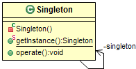

a. 简述  
面向对象应用程序中的单例类（singleton class）总是返回自己的同一个实例。它提供了对象所提供的资源的全局访问点。与这类设计相关的设计模式称为单例模式。  
用一种只允许生成对象类的唯一实例的机制，“阻止”所有想要生成对象的访问。  
这个方法应该是静态方法，因为让类的实例去生成另一个唯一实例毫无意义。  
b. 何时使用单例模式  
（1）类只能有一个实例，并且必须从一个为人熟知的访问点对其进行访问，比如工厂方法； 
（2）这个唯一的实例只能通过子类化进行扩展，而且扩展的对象不会破坏客户端代码。 
c. 单例的原则  
（1）发起调用的对象（calling object）不能以其他分配方式实例化单例对象。否则，就有可能创建单例类的多个实例。 
（2）对单例对象实例化的限制应用与引用计数内存模型共存。  
d. Cocoa Touch中常见的单例模式 
UIApplication，UIAccelerometer和NSFileManager类。  

##### 二、Abstract Factory，抽象工厂  
提供一个创建一系列相关或相互依赖对象的接口，而无须指定它们的具体类。 

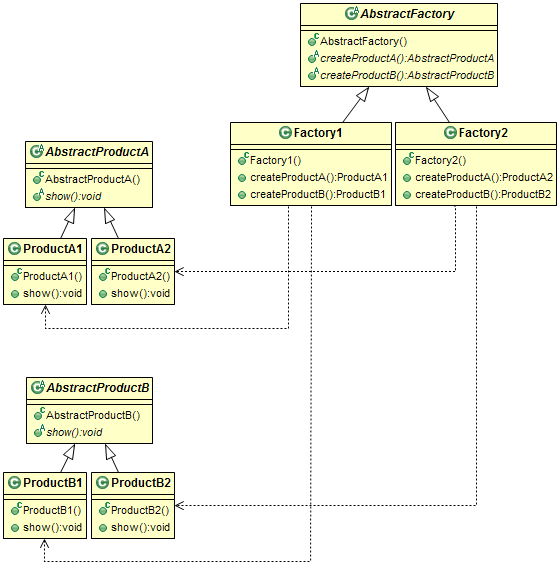

a. 抽象工厂与工厂方法的区别   

抽象工厂：  
（1）通过对象组合创建抽象产品；  
（2）创建多系列产品；  
（3）必须修改父类的接口才能支持新的产品。  

工厂方法：  
（1）通过类继承创建产品；  
（2）创建一种产品；  
（3）子类化创建者并重载工厂方法以创建新产品。  

##### 三、Factory Method，工厂方法   
定义一个用于创建对象的接口，让子类决定实例化哪一个类，Factory Method使一个类的实例化延迟到了子类。 

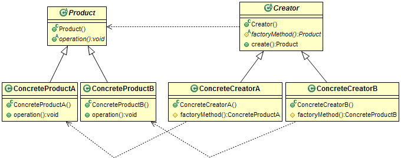

 a. 何时使用  
（1）编译时无法确定预期要创建的对象的类； 
（2）类想让其子类决定运行时创建什么； 
（3）类有若干辅助类为其子类，而你想将返回哪个子类这一信息局部化。 
   工厂方法模式让客户程序可以要求由工厂方法创建的对象拥有一组共同的行为。所以往类层次结构中引入新的具体产品并不需要修改客户端代码，因为返回的任何具体对象的接口都跟客户端一直在用的从前的接口相同。 
   工厂设计模式是面向对象软件设计中应用非常普遍的设计模式。工厂方法从代码中消除了对应用程序特有的耦合。代码只需要处理Product抽象接口。所以同一代码得以复用，在应用程序中与用户定义的任何ConcreteProduct类一起工作。 

##### 四、Builder，建造模式  
将一个复杂对象的构建与他的表示相分离，使得同样的构建过程可以创建不同的表示。 

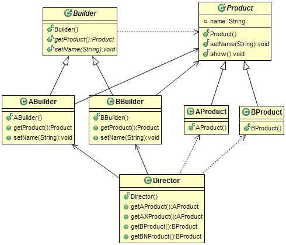

a. 何时使用  
（1）需要创建涉及各种部件的复杂对象。创建对象的算法应该独立于部件的装配方式。常见的例子是构建组合对象。 
（2）构建过程需要以不同的方式（例如，部件或表现的不同组合）构建对象。 
b. 生成器与抽象工厂的对比  
（1）生成器构建复杂对象，抽象工厂构建简单或者复杂对象； 
（2）生成器以多个步骤构建对象，抽象工厂以单一步骤构建对象； 
（3）生成器以多种方式构建对象昂，抽象工厂以单一步骤构建对象； 
（4）生成器在构建过程的最后一步返回产品，抽象工厂立刻返回产品； 
（5）生成器专注一个特定产品，抽象工厂强调一套产品。 

##### 五、Prototype，原型模式   
用原型实例指定创建对象的种类，并且通过拷贝这些原型来创建新的对象。 

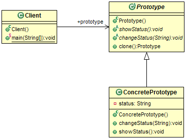

 a. 何时是用原型模式  
（1）需要创建的对象应独立于其类型与创建方式。 
（2）要实例化的类是在运行时决定的。 
（3）不想要与产品层次相对应的工厂层次。 
（4）不同类的实例间的差异仅是状态的若干组合。因此复制相应数量的原型比手工实例化更加方便。 
（5）类不容易创建，比如每个组件可以把其他组件作为子节点的组合对象。复制已有的组合对象并对副本进行修改会更加容易。 

 b. 浅复制与深复制  
如果对象有个指针型成员变量指向内存中的某个资源，那么如果复制这个对象呢？指针只是存储内存中资源地址的占位符。如果复制操作中，只是将指针复制给新对象（副本），那么底层的资源是架上仍然由两个实例在共享。 
因此只复制了指针而不是实际资源，这成为浅复制。 
深复制是指不仅复制指针值，还复制指针所指向的资源。不只是简单的复制资源指针，还要生成内存中实际资源的真正副本。因此副本对象的指针指向了内存中不同位置的统一资源（内容）的副本。 

 c. Cocoa Touch框架中的对象复制 
CocoaTouch框架为NSObject的派生类提供了实现深复制的协议。NSObject的子类需要实现NSCopying协议及其方法--（id）copyWithZone:(NSZone *)zone。NSObject有一个实例方法叫做（id）copy。默认的copy方法调用[selfcopyWithZone:nil]。对于采纳了NSCopying协议的子类，需要实现这个方法，否则将引发异常。IOS中，这个方法保持新的副本对象，然后将其返回。此方法的调用者需要负责释放返回的对象。 

深复制的技巧在于：保证确实复制了内存中的资源，而不只是指指针。 
此模式的最低限度是生成对象的真实副本，以用作同一环境下其他相关事物的基础（原型）。 

#### 行为型  
##### 六、Iterator，迭代器模式   
提供一个方法顺序访问一个聚合对象的各个元素，而又不需要暴露该对象的内部表示。 
##### 七、Observer，观察者模式   
定义对象间一对多的依赖关系，当一个对象的状态发生改变时，所有依赖于它的对象都得到通知自动更新。 

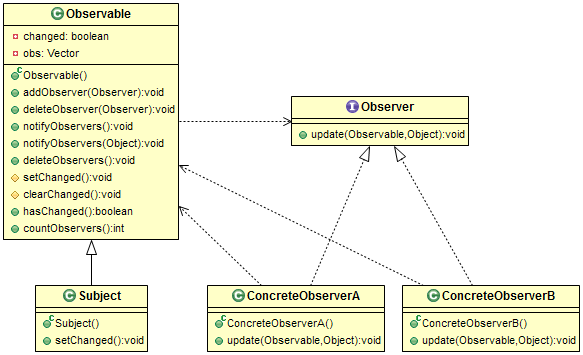

##### 八、Template Method，模板方法  
定义一个操作中的算法的骨架，而将一些步骤延迟到子类中，TemplateMethod使得子类可以不改变一个算法的结构即可以重定义该算法得某些特定步骤。 

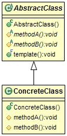

a. 何时使用  
(1) 需要一次性实现算法的不变部分，并将可变的行为留给子类实现  
(2) 子类的共同行为应该被提取放到公共类中，以避免代码重复。现有代码的差别应该被分离为新的操作。然后用一个调用这些操作的模板方法来代替这些不同的代码。 
(3) 需要控制子类的扩展。可以定义一个在特定点调用的“钩子”(hook)操作的模板方法。子类可以通过钩子操作的实现在这些扩展点扩展功能。 

b. 模板方法调用5种类型的操作  
(1) 对具体类或者客户端类的具体操作  
(2) 对抽象类的具体操作  
(3) 抽象操作  
(4) 工厂方法  
(5) 钩子操作  

##### 九、Command，命令模式   
将一个请求封装为一个对象，从而使你可以用不同的请求对客户进行参数化，对请求排队和记录请求日志，以及支持可撤销的操作。 

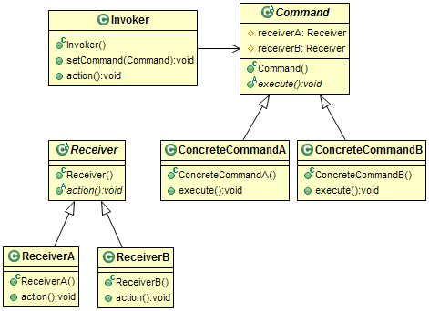

a. 何时使用  
（1）想让应用程序支持撤销与恢复； 
（2）想要对象参数化一个动作以执行操作，并用不同命令对象来代替回调函数； 
（3）想要在不同时刻对请求进行指定，排列和执行； 
（4）想记录修改日志，这样在系统故障时，这些修改可在后来重做一遍； 
（5）想让系统支持事务，失误封装了对数据的一系列修改。事务可以建模为命令对象。 

##### 十、State，状态模式  
允许对象在其内部状态改变时改变他的行为。对象看起来似乎改变了他的类。 

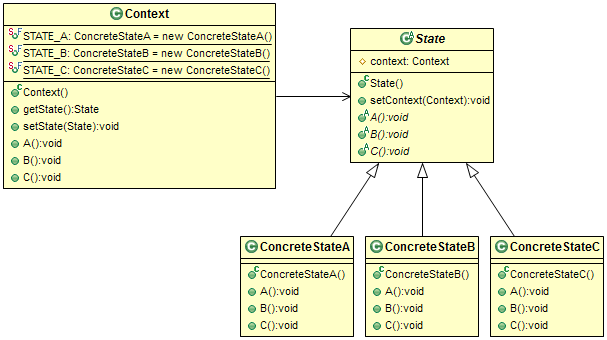

##### 十一、Strategy，策略模式  
定义一系列的算法，把他们一个个封装起来，并使他们可以互相替换，本模式使得算法可以独立于使用它们的客户。 

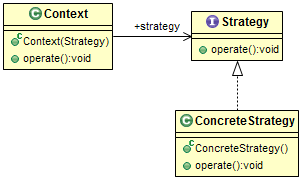

a. 简述  

策略模式中得一个关键角色是策略类，它为所有支持的或相关的算法声明了一个共同接口。另外，还有使用策略接口来实现相关算法的具体策略类。场景类的对象配置有一个具体策略对象的实例，场景对象使用策略接口调用由具体策略类定义的算法。  

定义一系列算法，把他们一个个封装起来，并且使他们可相互替换，本模式使得算法可独立于使用它的客户而变化。  

2.2 何时使用 

（1）一个类在其操作中使用多个条件语句来定义许多行为。我们可以把相关的条件分支移到他们自己的策略类中。 

（2）需要算法的各种变体。 

（3）需要避免把重复的，与算法相关的数据结构暴露给客户端。  

##### 十二、Chain of Responsibility，职责链模式  
使多个对象都有机会处理请求，从而避免请求的送发者和接收者之间的耦合关系  

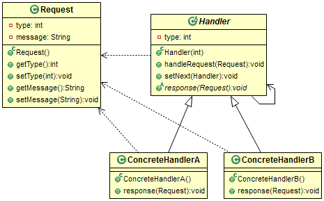

##### 十三、Mediator，中介者模式  
用一个中介对象封装一些列的对象交互。  

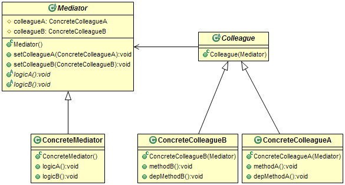

##### 十四、Visitor，访问者模式  
表示一个作用于某对象结构中的各元素的操作，它使你可以在不改变各元素类的前提下定义作用于这个元素的新操作。 

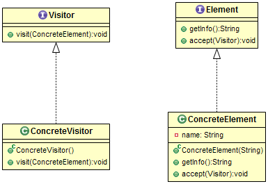

##### 十五、Interpreter，解释器模式  
给定一个语言，定义他的文法的一个表示，并定义一个解释器，这个解释器使用该表示来解释语言中的句子。 
##### 十六、Memento，备忘录模式  
在不破坏对象的前提下，捕获一个对象的内部状态，并在该对象之外保存这个状态。 

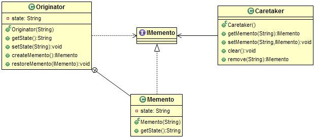

a. 简述   
在不破坏封装的前提下，捕获一个对象的内部状态，并在该对象之外保存这个状态。这样以后就可以将对象恢复到原先保存的状态。  

b. 何时使用  
（1）需要保存一个对象（或某部分）在某一时刻的状态，这样以后就可以恢复到先前的状态； 
（2）用于获取状态的接口会暴露实现的细节，需要将其隐藏起来。 

#### 结构型有  
##### 十七、Composite，组合模式  
将对象组合成树形结构以表示部分整体的关系，Composite使得用户对单个对象和组合对象的使用具有一致性。 

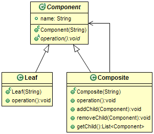

##### 十八、Facade，外观模式  
为子系统中的一组接口提供一致的界面，facade提供了一高层接口，这个接口使得子系统更容易使用。 

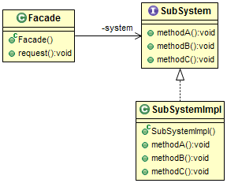

##### 十九、Proxy，代理模式  
为其他对象提供一种代理以控制对这个对象的访问  

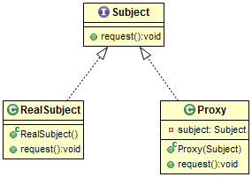

a. 简述  

为其他对象提供一种代理以控制对这个对象的访问。 

b. 代理分类  

（1）远程代理（remote proxy）：为位于不同地址空间或网络上的对象提供本地代表。 

（2）虚拟代理（virtual proxy）：根据需要创建重型对象。 

（3）保护代理（protection proxy）：根据各种访问权限控制对原对象的访问。 

（4）智能引用代理（smart-reference proxy）：通过对真正对象的引用进行计数来管理内存。也用于锁定真正对象，让其他对象不能对其进行修改。  

##### 二十、Adapter,适配器模式  
将一类的接口转换成客户希望的另外一个接口，Adapter模式使得原本由于接口不兼容而不能一起工作那些类可以一起工作。 

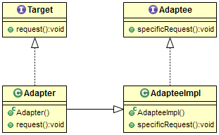

###### 详述
a. 简述   
适配器用于连接两种不同类型的对象，使其毫无问题地协同工作。有时它也称为“包装器”（wrapper）。适配器的主要作用是把被适配者的行为传递给管道另一端的客户端。  
适配器模式：将一个类的接口转换成客户希望的另外一个接口。适配器模式使得原本由于接口不兼容而不能在一起工作的哪些类可以一起工作。 

b. 种类  
（1）第一种是通过继承来适配两个接口，成为类适配器。要在Objective-C中实现类适配器，首先需要有定义了客户端要使用的一套行为的协议，然后要用具体的适配器来实现这个协议。适配器类同时也要继承被适配者。 
（2）第二种是对象适配器。对象适配器不继承被适配者，而是组合了一个对它的引用。适配者与被适配者之间的关系从“属于”变成了“包含”。这种关系下，适配者保持一个对被适配者的引用。 
c. 类适配器与对象适配器的区别 
（1）类适配器只针对单一的具体被适配者，把被适配者是配到目标接口；对象适配器可以适配多个被适配者及其子类。 
（2）类适配器易于重载被适配者的行为，因为是通过直接的子类化进行的适配；对象适配器难以重载被适配者的行为，需要借助与子类的对象而不是被适配者本身。 
（3）类适配器只有一个适配者对象，无需额外的指针间接访问被适配者；需要额外的指针以间接访问被适配者并适配其行为。 
c. 何时使用适配器模式 
（1）已有的接口与需求不匹配； 
（2）想要一个可复用的类，该类能够同可能带有不兼容接口的其他类协作； 
（3）需要适配一个类的几个不同子类，可是让每一个子类去子类化一个类适配器又不现实。  
d. 委托与适配器关系  
适配器模式：把类的接口变换成客户端需要的接口。这里的客户端他们是什么呢？是Cocoa Touch框架中的类。那么此处什么是Target（目标接口）呢？是一个委托协议。实现协议的具体类会是个适配器。那么什么是与框架不匹配需要适配的类呢？应用程序中的其他类。现在明白了为何委托模式其实是适配器模式。  
我们之所以说委托模式主要是适配器模式，是因为委托机制可以实现某些其他设计模式的意图，比如装饰模式。委托模式的实现有时会跟其他设计模式混在一起。 

##### 二十一、Decorator，装饰模式  
动态地给一个对象增加一些额外的职责，就增加的功能来说，Decorator模式相比生成子类更加灵活。 

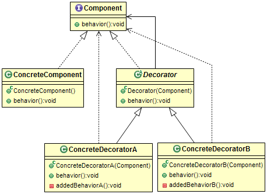

##### 二十二、Bridge，桥模式  
将抽象部分与它的实现部分相分离，使他们可以独立的变化。 

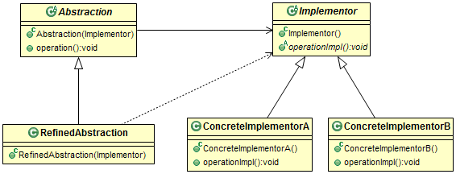

a. 何时使用  
（1）不想在抽象与其实现之间形成固定的绑定关系（这样就能在运行时切换实现）； 
（2）抽象及其实现都应可以通过子类化独立进行扩展； 
（3）对抽象的实现进行修改不应影响客户端代码； 
（4）如果每个实现都需要额外的子类以细化抽象，则说明有必要把他们分成两个部分； 
（5）想在带有不同抽象接口的多个对象之间共享一个实现。 

##### 二十三、Flyweight，享元模式  
运用共享技术有效的支持大量细粒度的对象。

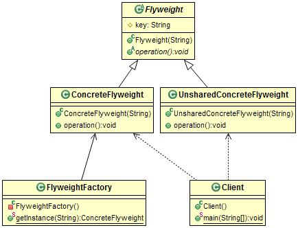

a. 何时使用  
（1）应用程序使用很多对象； 
（2）在内存中保存对象会影响内存性能； 
（3）对象的多数特有状态（外在状态）可以放到外部而轻量化； 
（4）移除了外在状态后，可以用较少的共享对象替代原来的那组对象； 
（5）应用程序不依赖于对象标示，因为共享对象不能提供唯一的标示。

   除了以上23个模式之外，根据《java与模式》中的分类，还有4种模式，DefaultAdapter 缺省适配器模式，SimpleFactory 简单工厂模式，Multiton 多例模式, Immutable 不变模式。

 参考： 
[设计模式之深入学习IOS版](http://blog.csdn.net/column/details/designpatternforios.html) 
